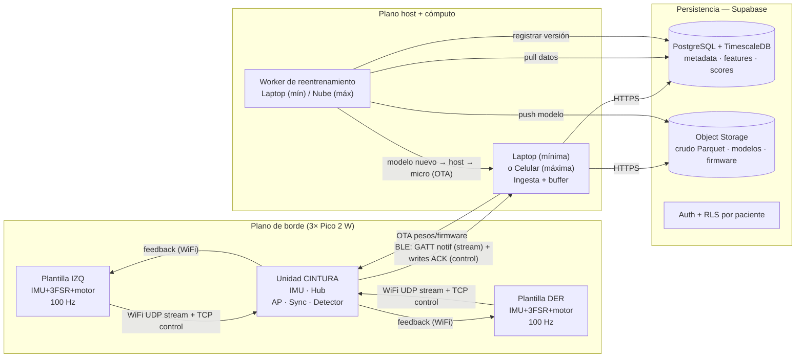

# Arquitectura Informática
## Sistema de plantillas inteligentes bilaterales para detección personalizada de anomalías de marcha post-ACV

**Proyecto:** TESIS — Detección de anomalías de marcha en pacientes post-ACV con plantillas bilaterales, feedback vibrotáctil e inferencia en el borde.
**Versión del documento:** 1.0 (borrador para revisión)
**Autor:** Juan Bautista Gramaglia
**Fecha:** julio 2026

---

## 1. Resumen ejecutivo

El sistema captura la marcha de un paciente mediante **dos plantillas instrumentadas** (una por pie) y **una unidad de cintura**, calcula descriptores biomecánicos (features) y detecta desviaciones respecto de la marcha "normal" personalizada del propio paciente, entregando **feedback vibrotáctil en tiempo real**. La filosofía de diseño es **personalización primero** (un baseline por paciente, no un modelo poblacional) y explotar la **simetría inter-miembro** que habilita la configuración bilateral.

La arquitectura se define en **dos horizontes**: un **objetivo de mínima** (entorno controlado, con una laptop cerca, orientado a capturar dataset y entrenar/evaluar algoritmos) y un **objetivo de máxima** (uso diario continuo, con un celular reemplazando a la laptop y un backend de reentrenamiento en la nube). Todo lo que se construye para la mínima está diseñado para **escalar sin reescrituras estructurales** hacia la máxima; los puntos donde la mínima y la máxima difieren están explícitamente aislados detrás de interfaces.

Este documento fija las decisiones de arquitectura, su justificación, y el detalle de implementación (topología, protocolos, sincronización, pipeline de datos, modelos, ciclo de vida, base de datos y seguridad). El **roadmap de implementación** se aborda en un documento aparte, una vez validada esta arquitectura.

---

## 2. Alcance

### 2.1 Objetivo de mínima

Que **toda la infraestructura funcione en un entorno controlado**, con una computadora (laptop) cerca capaz de captar los datos, almacenarlos y reentrenar los algoritmos. Concretamente:

- Las dos plantillas envían sus datos a la unidad de cintura.
- La cintura recibe ambos flujos **simultáneamente**, preservando la marca temporal de cada uno (o garantizando que lo recibido es inmediato de cada plantilla).
- La cintura reenvía los datos a la laptop.
- La laptop almacena los datos en una **base de datos remota** (no localmente) organizados por paciente.
- Sobre esos datos se **evalúan distintos algoritmos de forma asincrónica** (fase de entrenamiento y evaluación).
- Los algoritmos entrenados se **despliegan al micro** para correr localmente; los pesos/modelos también se **respaldan en la base de datos**.

### 2.2 Objetivo de máxima

Migrar la infraestructura de "entorno controlado con computadora cerca" a **uso diario continuo**:

- La laptop se reemplaza por un **celular**; la cintura se comunica con el celular por **Bluetooth (BLE)**.
- Persiste el guardado por paciente en la base de datos remota y el respaldo de modelos.
- El reentrenamiento de los algoritmos que "necesitan una computadora" corre en un **backend en la nube** (worker), no en el celular; el celular actúa como puente hacia el micro y hacia la nube.

### 2.3 Principio rector

**La infraestructura del lado del micro es la misma mande a una laptop o a un celular.** El micro es un periférico BLE (servidor GATT) agnóstico al tipo de central que se conecta. Lo único que cambia entre mínima y máxima es el **cliente** (app de laptop vs. app móvil) y la ubicación del **worker de reentrenamiento** (laptop vs. nube). Esto se garantiza con **interfaces de transporte y de despliegue** que aíslan esos puntos de variación.

---

## 3. Hardware

| Nodo | Cómputo | Sensores | Actuador | Rol |
|---|---|---|---|---|
| **Plantilla izquierda** | Raspberry Pi Pico 2 W (RP2350, Cortex-M33 @150 MHz, 520 KB SRAM, WiFi+BLE CYW43439) | MPU-6050 (IMU 6-DOF, I²C) + 3× FSR (ADC0-2) | Motor vibrador (PWM) | Sensado del pie izq + feedback |
| **Plantilla derecha** | Ídem | Ídem | Motor vibrador (PWM) | Sensado del pie der + feedback |
| **Unidad de cintura** | Raspberry Pi Pico 2 W | MPU-6050 | — | **Hub**: AP WiFi, maestro de sync, fusión bilateral, detección, uplink BLE |

**Muestreo:** 100 Hz. **Canales por pie:** 9 (accel XYZ, gyro XYZ, 3× FSR). La cintura suma su propio IMU (6 canales) como referencia de tronco/pelvis.

**Pinout de referencia (plantilla)** — nota: el pinout actual documenta 2 FSR (ADC0/ADC1); el tercero se asigna a **ADC2 = GP28 (pin 34)**.

| GPIO | Pin | Modo | Conectado a |
|---|---|---|---|
| GP20 | 26 | I²C0 SDA | IMU MPU-6050 |
| GP21 | 27 | I²C0 SCL | IMU MPU-6050 |
| GP26 | 31 | ADC0 | FSR 1 (divisor) |
| GP27 | 32 | ADC1 | FSR 2 (divisor) |
| GP28 | 34 | ADC2 | FSR 3 (divisor) *(a confirmar)* |
| GP18 | 24 | PWM | Base NPN → motor vibrador (con diodo flyback) |

**Consideración de radio:** el CYW43439 es un chip único WiFi+BLE con **una antena** en banda 2.4 GHz. La cintura debe sostener **WiFi-AP (a las plantillas) + BLE (al host)** de forma simultánea mediante **coexistencia** (time-division del radio). Esta coexistencia es un requisito permanente de la máxima y se asume desde la mínima (ver §12, Riesgos).

---

## 4. Vista general

El sistema se organiza en cuatro planos:

1. **Plano de sensado y borde** (los 3 micros): adquisición a 100 Hz, sincronización, detección de eventos, cálculo de features (modo edge), inferencia local (clases L/E) y feedback vibrotáctil.
2. **Plano de transporte:** WiFi (plantillas↔cintura) y BLE (cintura↔host), cada uno con un **canal rápido-tolerante** (stream) y un **canal confiable** (control/modelos).
3. **Plano de host y cómputo:** laptop (mínima) o celular + worker en la nube (máxima). Ingesta, entrenamiento/reentrenamiento pesado, orquestación.
4. **Plano de persistencia:** Supabase (PostgreSQL + TimescaleDB + object storage + auth), que actúa como **sistema de registro** de datos, features, scores y modelos.

El diagrama detallado de topología y flujos está en `diagrama_arquitectura.mermaid`; el esquema de la base de datos en `esquema_base_de_datos.mermaid`. Ambos se reproducen dentro de este documento (§9 y §10).



---

## 5. Topología de red y conectividad

### 5.1 Enlace plantillas ↔ cintura — WiFi, cintura como Access Point

La cintura crea su propia red WiFi (SSID propio) y actúa como **Access Point (AP)**; las dos plantillas se conectan como **estaciones (STA)**. Este enlace es **permanente**: no cambia entre mínima y máxima. La cintura es, por diseño, el punto de convergencia de ambos pies, lo que la convierte en el lugar natural para la fusión bilateral (§8).

**Justificación:** una topología en estrella de un solo salto (single-hop star) minimiza la complejidad, evita depender de infraestructura externa (funciona en cualquier lugar) y coloca la lógica de fusión donde los datos ya coinciden.

### 5.2 Enlace cintura ↔ host — BLE desde la mínima

La cintura expone un **servidor GATT BLE**; el host (laptop en mínima, celular en máxima) es el **central** que se conecta. Se adopta BLE **desde la mínima** (no WiFi) porque:

- El firmware BLE de la cintura es **idéntico** mande a laptop o a celular (el periférico es agnóstico al central), de modo que **se reutiliza al 100 %** en la máxima.
- Se enfrenta **temprano** el riesgo técnico central de la máxima: la coexistencia WiFi-AP + BLE en un solo chip.
- El caudal de datos (~5 KB/s incluyendo timestamps) está **muy por debajo** de lo que BLE soporta, por lo que no hay penalidad de ancho de banda.

**Restricción de diseño:** el firmware se dimensiona a las **restricciones del celular** desde el inicio (MTU BLE ~185 B típico en iOS, límites de connection-interval), para no sobre-ajustar a la BLE más permisiva de una laptop.

**Beneficio colateral:** como el uplink ya no ocupa el adaptador WiFi del host, la **laptop conserva internet** y puede empujar datos a Supabase sin conflicto.

### 5.3 Provisioning y redes

En la mínima no se requiere infraestructura externa: la cintura es AP y el host se conecta a ella. Para escenarios futuros donde los micros deban unirse a una red de infraestructura (casa/clínica), se prevé un **mecanismo de provisioning** (el Pico arranca como mini-AP con portal de configuración, o recibe credenciales por BLE, y luego conmuta a STA). No es necesario para el alcance actual; queda documentado como extensión.

---

## 6. Transporte y protocolos

Principio general: **dos canales por enlace**, uno optimizado para latencia y otro para integridad.

| Enlace | Canal rápido-tolerante (stream de 100 Hz) | Canal confiable (control, modelos, config) |
|---|---|---|
| **Plantillas ↔ cintura (WiFi)** | **UDP** con nº de secuencia + timestamp por muestra | **TCP** |
| **Cintura ↔ host (BLE)** | **Notificaciones GATT** (sin ACK) | **Writes con respuesta / Indicaciones** (con ACK) |

**Justificación (UDP para el stream):** a 100 Hz, perder una muestra ocasional es irrelevante (la siguiente llega en 10 ms), mientras que la retransmisión de TCP introduce *head-of-line blocking* — picos de latencia justo en el peor momento de un flujo en vivo. UDP con nº de secuencia + timestamp permite detectar y tolerar huecos sin frenar el flujo. **TCP para control** porque la transferencia de pesos/firmware exige que lleguen **todos los bytes** en orden. Sobre BLE el mismo principio se materializa con **notificaciones** (análogo a UDP) y **writes con ACK/indicaciones** (análogo a TCP).

**Formato de paquete de muestra (stream):** `[device_id | seq (uint32) | t_device (uint32, µs) | ax ay az gx gy gz (int16) | fsr1 fsr2 fsr3 (uint16)]`. El `seq` y `t_device` son la base de la sincronización (§7) y de la detección de pérdidas.

---

## 7. Sincronización temporal

La sincronización es crítica porque la **simetría inter-miembro** —el diferencial clínico del sistema— exige relacionar lo que ocurre en ambos pies sobre una **misma línea de tiempo a nivel de muestra**. Muchas features se calculan sobre **ventanas deslizantes de la señal bilateral** o requieren **simultaneidad** (p. ej. *double support* = lapso en que ambos pies tocan el piso a la vez; velocidad y cruces por cero del COP-ML; LDLJ; entropías; PSD). El emparejado por evento por sí solo **no** alcanza para estas features.

### 7.1 Backbone de reloj (mecanismo primario)

Se adopta un **backbone fuerte**, implementado en la **capa de aplicación** (por lo tanto **portable entre WiFi y BLE** sin cambios):

1. **Timestamp + nº de secuencia por muestra:** cada plantilla sella cada muestra con su propio reloj monotónico y un contador. La alineación se hace por el **instante de generación** del dato, no por el de llegada, de modo que un paquete demorado (jitter) igual cae en su lugar.
2. **Beacon de sincronización periódico:** la cintura emite un mensaje de referencia (estilo *Reference Broadcast* / sync a nivel de aplicación sobre BLE, documentado en la literatura con precisión de decenas de µs). Las plantillas expresan sus timestamps en el "tiempo de cintura".
3. **Corrección de drift por regresión lineal:** el reloj de cada nodo se modela como recta (offset + skew) contra la referencia y se corrige. Esto compensa el drift típico de cristal (~±0,2 ms/min).

**Problema que resuelve:** *offset* (relojes que arrancan en ceros distintos) y *skew/drift* (cristales que corren a ritmos algo distintos). Es el enfoque alineado con productos comparables (p. ej. Moticon mantiene la sincronización de las plantillas durante toda la grabación) y con la literatura de WBSN.

### 7.2 Emparejado por evento (capa de refinamiento, no primaria)

Sobre el backbone de reloj, se **empareja zancadas por eventos de contacto inicial (IC)** — el instante en que el pie empieza a cargar (detectado por umbral de FSR, respaldado por el pico del IMU), **no** un "talón primero" prolijo. Esto:

- Provee un emparejado **biomecánicamente correcto** para las métricas de simetría **por zancada** (Symmetry Index).
- Actúa como **red de seguridad** si el reloj driftea: cada pie se segmenta con su **propia** señal (un pie anómalo no ensucia la segmentación del otro), y el orden alternado de los pasos permite emparejar ciclos sin depender del reloj.
- **Degrada con gracia:** si en un paciente el IC se vuelve poco confiable, el sistema cae a alineación por reloj sola, suficiente a escala de zancada.

**Nota conceptual importante:** el evento IC **no sincroniza relojes** — empareja *zancadas*. La sincronización de reloj (backbone) es la que ordena las muestras de ambos pies para las ventanas y la simultaneidad. El IC es refinamiento para la simetría por zancada. Además, el IC ya se detecta para las features espacio-temporales (stance, swing, double support, loading rate, orientación en IC/toe-off), por lo que reutilizarlo para el emparejado es **gratuito**.

**Aclaración sobre patología:** un IC anómalo (reducido, ausente, demorado, asimétrico) **es parte de la señal de anomalía** y se mide como feature; usar el IC como marca temporal (sólo su índice) no entra en conflicto con medir su morfología (calidad del contacto) como feature de detección.

---

## 8. Pipeline de datos y cómputo

### 8.1 Dos modos de operación

El sistema opera en **dos modos** con una **única definición de features compartida** (misma fórmula en la PC y en el micro, para evitar discrepancias):

- **Modo captura** (fase de entrenamiento/evaluación): las plantillas envían **señal cruda** a la cintura, y la cintura la reenvía al host, que la persiste. Objetivo: construir dataset y evaluar algoritmos de forma asincrónica. El ancho de banda del crudo sobre WiFi (~3,6 KB/s de payload) es despreciable.
- **Modo edge** (uso real): la cintura calcula **features + detección on-device** y sólo emite features/scores (y crudo puntual ante anomalías, §10.3). Es lo que habilita el uso sin computadora cerca (máxima) y los algoritmos de clase L/E.

### 8.2 La cintura como hub de cómputo

Como ambos flujos convergen en la cintura, ésta es el **hub de cómputo on-device**: recibe el crudo de ambas plantillas, mantiene la línea de tiempo común, **detecta eventos**, **calcula las features bilaterales**, **corre los detectores** de clase L/E y **decide el feedback**. Las plantillas quedan como **sensores de alta calidad** (opcionalmente detectan su propio IC), lo que simplifica su firmware. La carga de la cintura es liviana: el cálculo de features es por zancada (~1 Hz de decisiones) y la inferencia int8 sobre un vector de ~25 features es mínima.

### 8.3 Camino de feedback vibrotáctil

El detector corre en la cintura, pero el **motor vibrador está en las plantillas**. Por lo tanto el enlace plantillas↔cintura es **bidireccional**: datos hacia arriba (plantilla→cintura) y **comandos de feedback hacia abajo** (cintura→plantilla, por el canal WiFi). La *política* de feedback (cuándo/cómo vibrar) es lógica de aplicación y se define fuera de este documento de infraestructura; aquí se garantiza el **camino**.

### 8.4 Features (referencia)

El conjunto consolidado es de **41 features en 8 bloques** (A espacio-temporales, B variabilidad, C fuerza/FSR, D simetría, E COP-1D, F cinemática IMU, G smoothness/LDLJ, H frecuencia/entropía). La definición canónica vive en un **módulo compartido** versionado (`feature_set_version`) usado tanto por el firmware (C/C++) como por el worker (Python), de modo que el crudo histórico siempre pueda re-procesarse con la misma semántica.

---

## 9. Modelos y Machine Learning

### 9.1 Taxonomía de modelos (ruteo declarado en el registry)

La arquitectura es **agnóstica al modelo**: cada modelo declara su **clase** en el registry, y el runtime rutea inferencia y reentrenamiento según esa declaración. Esto es esencial porque **el reparto exacto depende de qué modelos se prueben**.

| Clase | Inferencia | Reentrena | Granularidad | Ejemplos candidatos | ¿Usa OTA? |
|---|---|---|---|---|---|
| **L — Local-Local** | Micro | **Micro** | Dato a dato (online) | Mahalanobis (EMA de media + covarianza), z-score/EWMA, probabilísticos simples, running stats | No (se auto-actualiza) |
| **E — Edge + Worker** | Micro (int8) | **Worker** | Periódico / async | Autoencoder denso int8, LSTM chico cuantizado | Sí (recibe pesos) |
| **W — Worker-heavy** | Worker (o micro si entra) | **Worker** | Periódico / async | LSTM autoencoder grande, Isolation Forest, gradient-based | Sí (si despliega al micro) |

Cada fila de la tabla `models` declara `(class, inference_target, retrain_target, granularity)`. Sumar un modelo nuevo = declarar su clase; la infraestructura ya soporta el camino. Las asignaciones de ejemplo son un primer pase y se ajustan a medida que se valida.

### 9.2 Mahalanobis como detector y sensor de drift

La distancia de Mahalanobis cumple **doble función**: (a) detector en vivo de clase L (z-score multivariado con matriz de covarianza inversa y umbral calibrado por chi-cuadrado), y (b) **sensor de drift** — cuando la distribución de la marcha se aleja del baseline, dispara el **reentrenamiento** de los modelos de clase E/W. Los modelos de clase L **no** necesitan disparo: se adaptan continuamente, dato a dato, en el micro.

### 9.3 Personalización

El baseline es **por paciente**: se define en una **sesión de calibración** con marcha normal/estable del sujeto, y todos los modelos personalizados (`patient_id` no nulo en el registry) se anclan a ese baseline. La evidencia (p. ej. one-class personalizado AUC≈0,97 vs. ~55 % de un modelo global) sostiene esta decisión.

---

## 10. Ciclo de vida de modelos

### 10.1 Dónde se entrena

- **Clase L:** en el **micro**, dato a dato. Nunca toca el worker.
- **Clase E/W en mínima:** en la **laptop** (Python: sklearn/PyTorch), sobre los datos capturados. La laptop **es** el worker en la mínima.
- **Clase E/W en máxima:** en el **worker de la nube** (VPS/contenedor/instancia con GPU si hace falta), que jala datos de Supabase, reentrena, escribe el modelo nuevo a Supabase y avisa al celular; el celular lo baja y lo despliega al micro.

Supabase **no** entrena: es el sistema de registro. Sus *Edge Functions* pueden usarse como **disparador** liviano (p. ej. "al escribirse un flag de drift, encolar un job de reentrenamiento"), no como entrenador.

### 10.2 Despliegue OTA — pesos y firmware (A/B)

Se adopta **OTA completo (pesos + firmware) desde el inicio**, con esquema **A/B** y bootloader:

- **Pesos (modelos):** se envía sólo el artefacto del modelo (Mahalanobis = media + inversa de covarianza; AE/LSTM = flatbuffer int8 de TFLite Micro) a un **slot** libre de modelo en flash; se valida **checksum**; se **conmuta atómicamente**; el modelo anterior queda como **last-known-good** para **rollback**.
- **Firmware:** un **bootloader A/B** mantiene dos imágenes de firmware; arranca la nueva y, si no "reporta OK" tras el arranque, **revierte** a la anterior. Habilita corregir bugs y actualizar el código de inferencia **remotamente, sin cable** — imprescindible con equipos en casa del paciente (máxima).

**Contrapartida asumida:** mayor complejidad (bootloader robusto) y riesgo de brickeo ante fallos de energía/bootloader; se mitiga con A/B, validación por checksum, watchdog y un modo de recuperación. El uso de flash aumenta (dos firmwares + dos slots de modelo), dentro de la capacidad del RP2350.

### 10.3 Versionado, respaldo y disparo

Todo modelo se **respalda en la base de datos** (fila en `models` + artefacto en object storage) con versión, métricas y linaje (`parent_version`), de modo que si el micro se rompe o se pierde, el modelo se recupera. El **disparo** de reentrenamiento puede ser por **drift** (Mahalanobis), por **schedule** (periódico) o **manual**; queda registrado en `retrain_jobs`. Cuando un modelo se reentrena fuera del micro, los **pesos/modelo nuevos se envían al micro** para que los cargue y empiece a usarlos, y la versión anterior se conserva para rollback.

---

## 11. Persistencia — Base de datos

### 11.1 Plataforma y motor

**Supabase** como plataforma gestionada: **PostgreSQL** (con extensión **TimescaleDB** para series temporales) + **object storage** (crudo comprimido, artefactos de modelos, imágenes de firmware) + **auth** + **API REST/realtime autogenerada**. Justificación: mínima operación (sin sysadmin), Postgres real y extensible, storage y auth integrados, y un camino de escalado limpio hacia la máxima con el reentrenamiento en un worker externo.

**Modelo de datos:** relacional para metadata (pacientes, sesiones, dispositivos, modelos), **hypertables de Timescale** para series (features, scores, eventos, snippets de crudo por anomalía), y **object storage** para blobs pesados (crudo continuo en Parquet, artefactos de modelos/firmware) referenciados desde tablas.

### 11.2 Política de retención (tiered por fase)

Se adopta la política **tiered desde el inicio**:

- **Fase de dataset:** se guarda **crudo completo** (Parquet en storage) + features + eventos + scores + modelos → máxima trazabilidad para re-extraer features y reevaluar algoritmos.
- **Uso real rutinario (máxima):** se guardan **features/eventos/scores**; el **crudo sólo se retiene alrededor de eventos de anomalía/drift** (buffer circular disparado por el evento). Ahorra almacenamiento (~4 GB/mes/paciente de crudo continuo evitados) conservando lo clínicamente interesante. Encaja de forma natural con el sensor de drift de Mahalanobis.

### 11.3 Esquema (DDL de referencia)

```sql
-- Metadata relacional
create table patients (
  id uuid primary key default gen_random_uuid(),
  external_code text unique,            -- código anónimo, no PII directa
  birth_year int,
  sex text,
  affected_side text check (affected_side in ('left','right','none')),
  clinical_notes jsonb,
  created_at timestamptz default now()
);

create table devices (
  id uuid primary key default gen_random_uuid(),
  role text check (role in ('insole_left','insole_right','waist')),
  hw_revision text,
  firmware_version text,
  created_at timestamptz default now()
);

create table sessions (
  id uuid primary key default gen_random_uuid(),
  patient_id uuid references patients(id),
  mode text check (mode in ('capture','edge')),
  feature_set_version text,
  environment text,                     -- 'lab','clinic','home'
  device_set jsonb,                     -- {left, right, waist device ids}
  started_at timestamptz,
  ended_at timestamptz,
  notes text
);

-- Crudo continuo: referencia a Parquet en object storage
create table raw_blobs (
  id uuid primary key default gen_random_uuid(),
  session_id uuid references sessions(id),
  device_id uuid references devices(id),
  storage_url text,                     -- object storage
  format text default 'parquet',
  start_time timestamptz,
  end_time timestamptz,
  n_samples bigint,
  checksum text
);

-- Crudo puntual retenido ante anomalía (uso real)
create table anomaly_raw_snippets (
  id uuid primary key default gen_random_uuid(),
  session_id uuid references sessions(id),
  device_id uuid references devices(id),
  score_id uuid,                        -- fk a anomaly_scores
  storage_url text,
  start_time timestamptz,
  end_time timestamptz
);

-- Eventos de marcha (hypertable)
create table gait_events (
  time timestamptz not null,
  session_id uuid references sessions(id),
  device_id uuid references devices(id),
  foot text check (foot in ('left','right')),
  type text check (type in ('IC','TO')),
  confidence real
);
select create_hypertable('gait_events','time');

-- Vectores de features por zancada/ventana (hypertable)
create table feature_vectors (
  time timestamptz not null,            -- fin de zancada/ventana
  session_id uuid references sessions(id),
  patient_id uuid references patients(id),
  scope text check (scope in ('left','right','bilateral')),
  feature_set_version text,
  features jsonb,                       -- {feature_name: value}
  stride_id bigint
);
select create_hypertable('feature_vectors','time');

-- Scores del detector (hypertable)
create table anomaly_scores (
  time timestamptz not null,
  session_id uuid references sessions(id),
  patient_id uuid references patients(id),
  model_id uuid references models(id),
  score double precision,
  threshold double precision,
  is_anomaly boolean,
  drift_metric double precision
);
select create_hypertable('anomaly_scores','time');

-- Registry de modelos (respaldo + ruteo)
create table models (
  id uuid primary key default gen_random_uuid(),
  patient_id uuid references patients(id),   -- null = modelo global
  algo text,                                 -- 'mahalanobis','dense_ae','lstm_ae','iforest'...
  class text check (class in ('L','E','W')),
  inference_target text check (inference_target in ('micro','worker')),
  retrain_target text check (retrain_target in ('micro','worker')),
  granularity text check (granularity in ('online','periodic','async')),
  version int,
  parent_version int,
  feature_set_version text,
  artifact_url text,                         -- object storage
  artifact_format text,                      -- 'tflite_int8','npz','json'
  checksum text,
  metrics jsonb,                             -- {auc, threshold, ...}
  status text check (status in ('active','shadow','archived','rolled_back')),
  created_at timestamptz default now(),
  deployed_at timestamptz
);

-- Despliegues por dispositivo (qué corre en cada micro)
create table model_deployments (
  id uuid primary key default gen_random_uuid(),
  model_id uuid references models(id),
  device_id uuid references devices(id),
  deployed_at timestamptz default now(),
  status text check (status in ('active','rolled_back')),
  rolled_back_at timestamptz
);

-- Imágenes de firmware (OTA A/B)
create table firmware_images (
  id uuid primary key default gen_random_uuid(),
  version text,
  target_role text check (target_role in ('insole','waist')),
  storage_url text,
  checksum text,
  created_at timestamptz default now()
);

-- Orquestación de reentrenamiento
create table retrain_jobs (
  id uuid primary key default gen_random_uuid(),
  trigger text check (trigger in ('drift','schedule','manual')),
  patient_id uuid references patients(id),
  model_in uuid references models(id),
  model_out uuid references models(id),
  status text check (status in ('queued','running','done','failed')),
  worker text,
  started_at timestamptz,
  finished_at timestamptz,
  logs_url text
);
```

---

## 12. Backend de reentrenamiento

- **Mínima:** la **laptop** corre los scripts de entrenamiento (Python) sobre los datos capturados, produce artefactos, los sube a Supabase y los despliega al micro por OTA.
- **Máxima:** un **worker en la nube** (VPS/contenedor/instancia; con GPU si el modelo lo requiere) jala datos de Supabase, reentrena cualquier modelo (incluidos los pesados de clase W), escribe el artefacto a Supabase, registra la versión y notifica al celular, que lo despliega al micro. El **tier 1 (clase L) permanece en el micro**; el worker sólo interviene en E/W.

Orquestación: un job en `retrain_jobs` se dispara por drift/schedule/manual; el worker lo toma, entrena, publica el modelo y actualiza el registry. La app (laptop/celular) observa el registry y ejecuta el despliegue OTA.

---

## 13. Seguridad y privacidad

Al tratarse de **datos de salud**, se adopta una postura de defensa en capas (propuesta para revisión):

- **En tránsito:** WiFi WPA2 en el enlace plantillas↔cintura; **emparejamiento/cifrado BLE** (LE Secure Connections) en cintura↔host; **HTTPS/TLS** hacia Supabase.
- **En reposo:** cifrado del object storage y de la base gestionado por la plataforma; artefactos validados por checksum.
- **Aislamiento por paciente:** **Row-Level Security (RLS)** de Supabase para que cada usuario/paciente sólo acceda a sus datos; `external_code` anónimo en lugar de PII directa siempre que sea posible.
- **Consentimiento y minimización:** consentimiento informado; la política de retención tiered (crudo sólo ante anomalías en uso real) reduce la superficie de datos sensibles.

---

## 14. Evolución mínima → máxima

| Componente | Mínima | Máxima | ¿Cambia? |
|---|---|---|---|
| Plantillas ↔ cintura | WiFi (AP), UDP+TCP | Ídem | **No** |
| Sincronización | Backbone reloj (capa app) + IC | Ídem (portable a BLE) | **No** |
| Cintura ↔ host | **BLE** (GATT) | **BLE** (GATT) | **No** (sólo cambia el central) |
| Host | Laptop (ingesta + worker) | Celular (ingesta + puente) | Sí (app) |
| Worker de reentrenamiento | Laptop | **Nube** | Sí (ubicación) |
| Base de datos | Supabase | Supabase | **No** |
| Retención | Tiered (dataset) | Tiered (crudo por anomalía) | Evoluciona la fase |
| OTA | Pesos + firmware A/B | Ídem | **No** |

Los únicos puntos de variación (app del host y ubicación del worker) están **aislados detrás de interfaces** (transporte y despliegue), por lo que la migración no toca el borde ni la persistencia.

---

## 15. Resumen de decisiones

| # | Decisión | Elección | Justificación breve |
|---|---|---|---|
| 1 | Enlace plantillas↔cintura | WiFi, cintura = AP | Estrella single-hop, sin infraestructura externa, fusión donde convergen los datos; permanente en máxima |
| 2 | Uplink cintura↔host | BLE desde la mínima | Firmware de cintura reutilizado 100 %; de-riskea la coexistencia temprano; BW sobra |
| 3 | Transporte | UDP stream + TCP control (WiFi); GATT notif + writes ACK (BLE) | Canal rápido-tolerante + canal confiable; evita head-of-line blocking en el stream |
| 4 | Sincronización | Backbone reloj (timestamp+seq+beacon+drift) + emparejado por IC | Simetría bilateral necesita timeline a nivel de muestra; IC como refinamiento gratuito |
| 5 | Cálculo de features | Dual-mode (captura vs edge), definición compartida PC↔micro | Dataset primero sin perder el camino edge; una sola semántica de features |
| 6 | Hub de cómputo | Cintura | Ambos pies convergen ahí; carga liviana |
| 7 | Hosting/DB | Supabase (Postgres+Timescale+storage+auth) | Mínima operación, Postgres real, escalado limpio |
| 8 | Modelo de datos | Postgres + TimescaleDB + object storage | Relacional + series + blobs, un solo mundo SQL |
| 9 | Retención | Tiered por fase (+ crudo por anomalía) | Trazabilidad en dataset, costo/privacidad en uso real |
| 10 | Backend de reentrenamiento (máxima) | Worker en la nube (E/W); micro mantiene L | Cómputo sin límites para lo pesado; lo simple queda local |
| 11 | Firmware | C/C++ con Pico SDK | ML on-device + coexistencia + 100 Hz duro |
| 12 | Ruteo de modelos | Clase declarada en el registry (L/E/W) | Agnóstico al modelo; sumar modelo = declarar clase |
| 13 | OTA | Pesos + firmware completo (A/B) desde el inicio | Fix/inferencia remotos en casa del paciente; rollback seguro |

---

## 16. Riesgos y mitigaciones

| Riesgo | Impacto | Mitigación |
|---|---|---|
| Coexistencia WiFi-AP + BLE en el CYW43439 | Paquetes caídos / desconexiones en la cintura | Enfrentarla desde la mínima; tuning de intervalos; priorización; pruebas de carga tempranas |
| Precisión de sincronización insuficiente | Errores en features bilaterales | Backbone con beacon + drift; validación de precisión; fallback a emparejado por IC |
| Detección de IC poco fiable en marcha muy patológica | Segmentación/emparejado ruidoso | Detección por umbral de FSR (robusta), degradación a reloj solo, IC como refinamiento no crítico |
| ML on-device excede recursos del RP2350 | Inferencia lenta / no cabe | Cuantización int8 (TFLite Micro); modelos pesados en clase W (worker) |
| Brickeo por OTA de firmware | Dispositivo inutilizable | Bootloader A/B, checksum, watchdog, modo recuperación, last-known-good |
| Crecimiento de crudo en uso diario | Costo de almacenamiento | Retención tiered + crudo sólo por anomalía |
| Datos de salud | Privacidad/compliance | Cifrado en tránsito/reposo, RLS por paciente, anonimización, consentimiento |

---

## 17. Cuestiones abiertas (para revisión)

Las cuestiones abiertas y puntos a ratificar se llevan en un **registro vivo aparte**, que es la única fuente de verdad: **`docs/cuestiones_pendientes.md`**. Al momento de esta versión incluyen (ver IDs CP-01 a CP-06): tercer FSR en ADC2/GP28, cintura-como-hub vs. features-en-plantilla, dónde detectar el IC, rigor de seguridad, esquema de `feature_vectors` y proveedor del worker en la nube.

---

*Próximo paso (documento aparte): roadmap de implementación por fases para alcanzar esta arquitectura.*
